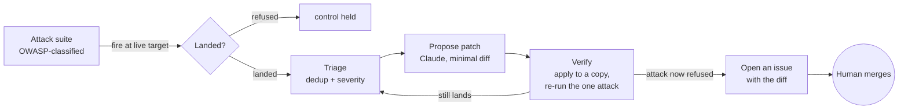

# redteam-loop

An automated red-team loop that fires OWASP-classified attacks at a running
target, triages what lands, proposes a minimal patch, and **verifies the patch
actually closes the hole** before a human ever looks at it. The machine does the
detection, classification, proposal, and verification. A person owns the merge.

> **Target** — any HTTP service; the reference target is a multi-tenant SaaS API.
> **Security architecture** — controls enforced at the layer that can't be routed
> around (database, middleware), then continuously attacked to prove they hold.
> **The AI red-team loop** — an automated CI-ready system that injects malicious
> payloads simulating real attacks, detects which controls fail, feeds the
> offending source to Claude for a minimal patch, applies it to a throwaway copy,
> and **re-runs the exact attack to confirm the fix** before opening an issue a
> human merges.

## Try it in 30 seconds

No config, no key, no target of your own — the demo ships its own vulnerable
service and attacks it:

```bash
git clone https://github.com/Th3Circle-app/redteam-loop && cd redteam-loop
npm install
npm run demo
```

You'll see ten attacks fire, eight land, each tagged with its OWASP category.
Set `ANTHROPIC_API_KEY` and re-run to watch Claude propose a fix for each finding
and the loop verify it closes the hole.

```bash
npm test          # 11 tests, real HTTP targets, no mocks
npm run scan -- target.json   # point it at your own staging service
```


*A scan against a deliberately vulnerable target. Ten attacks fire, eight land,
each already tagged with its OWASP 2021 category. `a03-sqli-tautology` and
`a05-stack-trace` pass because that target happens to handle those correctly —
the verdict is the response, not an assumption.*

### The full loop, run for real

`examples/live-loop.mjs` runs every stage against a live target with the real
API. Below is one finding from an actual run: Claude proposed the auth gate, the
loop applied it to a throwaway copy, re-ran the exact attack, and confirmed the
endpoint now answers **401**. `3 verified closed` means three attacks that
landed were re-run against the patched code and refused.


```bash
export ANTHROPIC_API_KEY=sk-ant-...
node examples/live-loop.mjs
# 8 findings · 3 with a proposed patch · 3 verified closed
```

Built as the generalized, standalone version of the security work in
[th3circle.app](https://th3circle.app) and
[tenant-isolation-postgres](https://github.com/Th3Circle-app/tenant-isolation-postgres):
tests that execute the exploit and assert it fails, extended into a loop that
also proposes and checks the fix.

---

## What it is, honestly

The tempting pitch is "an AI that autonomously patches production security
holes." That is not what this is, and I would not run that against anything I
cared about. Autonomous merge-to-prod on a security finding is how you turn one
vulnerability into two.

What this actually does is the defensible four-step version:



Detection is deterministic. Classification is built into each attack.
The patch is a *proposal* on a throwaway copy of the file — the real repository
is never written to and no PR is opened automatically. Verification re-runs the
exact attack against the patched copy and only reports "closed" if it now fails.
The output is an issue a person reviews and merges. That boundary is the point.

---

## The four stages

### 1. Attacks — OWASP-classified payloads

[`src/attacks/index.js`](src/attacks/index.js) is a library of requests a
correct target refuses. Each carries its OWASP 2021 category and an `expect`
predicate that defines "refused" for that specific attack:

| OWASP 2021 | Attacks in the suite | AppSec discipline |
|---|---|---|
| **A01 · Broken Access Control** | unauthenticated call, forged `alg:none` token, path traversal, null-byte extension bypass | Broken Object Level Authorization (BOLA) mitigation · input-validation testing |
| **A03 · Injection** | reflected XSS, SQL tautology | Injection & input-validation testing |
| **A05 · Security Misconfiguration** | reflected-Origin CORS, wrong HTTP method, stack-trace leak | Information-disclosure & attack-surface hardening |
| **A08 · Data Integrity Failures** | client-supplied sender spoofing | Identity-forgery / request-integrity mitigation |

This is a **DAST** tool — dynamic application security testing: it attacks a
*running* service and judges it by the real response, the same way a pen-tester
or a CI security gate does. (It is not SAST; it never inspects source to reach a
verdict — only to propose the fix.)

A finding is never the model's opinion — it is the attack's own predicate
applied to the real HTTP response.

### 2. Runner — fire and record

[`src/runner.js`](src/runner.js) makes each request against a live target and
records whether the control held. Pure I/O; it knows nothing about patching.

### 3. Triage → propose

[`src/loop.js`](src/loop.js) dedups findings and sorts them high-severity first,
then [`src/patch.js`](src/patch.js) asks Claude
(`claude-opus-5`, adaptive thinking) for the **minimal unified diff** that closes
one specific hole — instructed not to refactor, rename, or touch anything
adjacent, and to prefer enforcing the control at the database or middleware layer
over patching one handler. No key configured? The step degrades to "patch
skipped" and the scan still runs.

### 4. Verify — the part that matters

[`src/apply.js`](src/apply.js) applies the proposed diff to a **throwaway copy**
of the file using `git apply --check` (the same validation a reviewer's
`git apply` runs), then the loop re-runs the one attack against a target serving
the patched copy. "Closed" means the attack that just landed now fails. A diff
that doesn't apply, or applies but doesn't close the hole, is reported as such —
never waved through.

The whole loop is small enough to read at a glance ([`src/loop.js`](src/loop.js)):

```js
for (const finding of triage(findings)) {
  const file = resolveSource(finding);                 // the source that serves the hole
  const { patch } = await proposePatch(finding, file); // Claude: minimal diff, unapplied
  const verified = await verify(finding, file, patch); // apply to a copy, re-run the attack
  items.push({ finding, patch, verified });            // report; a human merges
}
```

`verify` is where the honesty lives — it re-fires the exact attack at the patched
code and only reports `closed` when the response proves the control now holds:

```js
const applied = await applyToCopy(file, patch);        // throwaway copy, git apply --check
if (!applied.ok) return { closed: false, reason: ... };
const patchedTarget = await retarget(applied.dir);     // stand the fix up
const res = await runAttack(attack, patchedTarget);    // fire the same payload again
return { closed: res.held, status: res.status };       // held == the attack was refused
```

---

## Real problems this solves

- **RLS looks right and still leaks.** The reference target's whole reason for
  existing: a Postgres tenant can pass a row-level-security check and still write
  a column it shouldn't. A policy review misses it; an attack that tries the write
  and asserts a refusal does not. This loop runs that attack on every push.
- **A fix that doesn't actually fix.** "I added an auth check" is a claim. Re-running
  the exact request that got in and watching it now return 401 is evidence. The
  loop refuses to call anything closed without that second run.
- **Security tests that pass no matter what.** A test asserting the right things
  work says nothing about whether the wrong things are blocked. Every attack here
  is a payload that *should* fail — the suite is the negative space most test
  suites leave empty.
- **Model patches that silently don't apply.** Real models emit diffs `git apply`
  rejects. The loop normalizes and verifies them instead of trusting them, so a
  proposed fix is either provably applied or loudly rejected.

---

## The tests are the argument

Every claim above has a test in [`tests/runner.test.js`](tests/runner.test.js)
that runs against a real local HTTP server, not a mock:

- the vulnerable target produces findings, each OWASP-classified
- the **hardened** twin refuses the same attacks — so the suite distinguishes
  broken from fixed, which is the whole job
- a real hardening diff applies cleanly and a bogus diff is rejected
- verify re-runs an attack after a fix and reports it closed

```
node --test
ℹ tests 11   ℹ pass 11   ℹ fail 0
```

CI runs the suite on every push ([`.github/workflows/ci.yml`](.github/workflows/ci.yml)).

---

## Targeting your own service

`scan` and `loop` take a small JSON config:

```json
{
  "baseUrl": "https://staging.your-service.example",
  "authedPath": "/api/send",
  "uploadPath": "/api/upload",
  "echoPath": "/api/search",
  "sourceMap": { "a01-no-token": "src/routes/send.js" }
}
```

`sourceMap` tells the loop which file serves each attacked endpoint, so the patch
step has something concrete to diff. Point it at **staging**, not production —
the attacks are real requests.

---

## Layout

```
src/attacks/index.js   OWASP-classified payload library
src/runner.js          fire an attack, record whether the control held
src/loop.js            triage → propose → verify
src/patch.js           Claude proposes a minimal diff (never applies it)
src/apply.js           git apply --check against a throwaway copy
src/report.js          render a finding + diff as a GitHub issue body
src/cli.js             redteam scan | loop
examples/live-loop.mjs full loop against a live target with the real API
tests/                 the whole thing, against real local targets
```

## A note on applying model diffs

Language models reliably emit unified diffs with a **bare `@@` hunk header** and
no line numbers, which `git apply` and `patch` both reject outright — the first
live run lost three otherwise-correct patches to exactly this. Rather than nag
the model for better formatting, [`src/apply.js`](src/apply.js) recomputes every
hunk header from the source by locating the hunk's context, then applies the
result with `git apply --check`. A hunk whose context isn't in the source
**throws** — a diff that doesn't match is a failure, not something to massage
into applying in the wrong place.

MIT.
